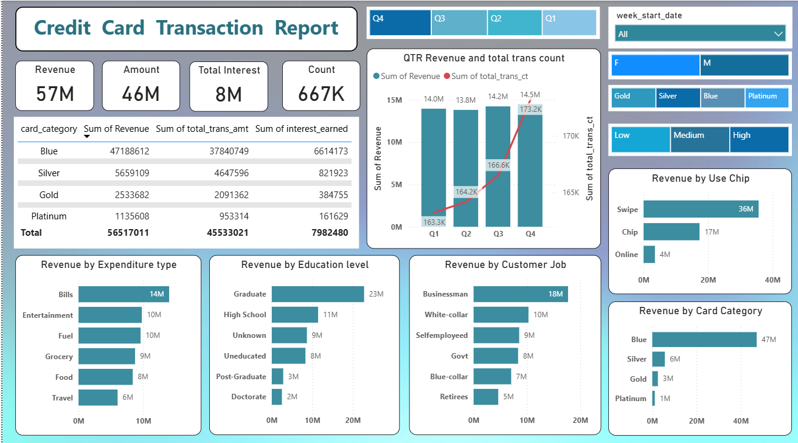
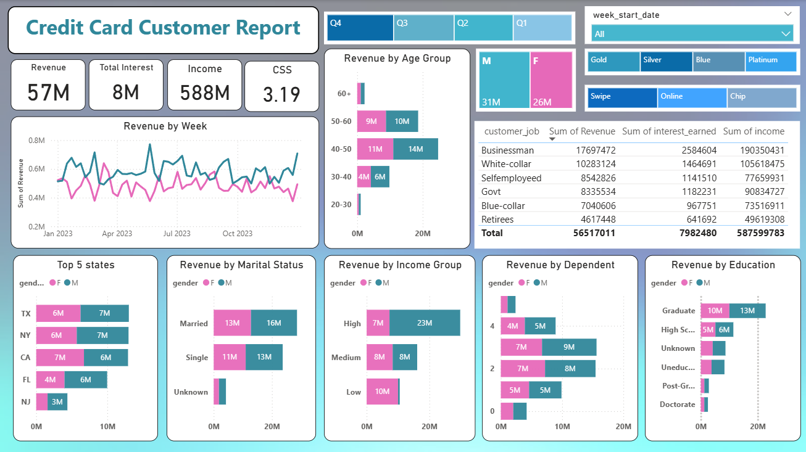

#  Credit Card Financial Dashboard & Weekly Report

An end-to-end data analysis project built using **PostgreSQL**, **Power BI**, and **DAX** to track and analyze key financial metrics, customer demographics, and transactional trends for a credit card portfolio.

---

##  Dashboard Previews

### 1. Credit Card Transaction Report


### 2. Credit Card Customer Report


---

##  Project Overview
The objective of this project is to develop a comprehensive weekly dashboard that provides real-time insights into key performance metrics (KPIs), enabling stakeholders to monitor and analyze credit card operations efficiently.

### Key Features:
* **Real-Time Data Pipeline:** Connected Power BI directly to a local PostgreSQL database, enabling seamless data refreshes for weekly reporting cycles.
* **Advanced DAX Calculations:** Built custom metrics for week-over-week (WoW) revenue change, current/previous week analytics, and automated age/income demographic grouping.
* **Interactive Filtering:** Enabled dynamic filtering by quarters, income brackets, card categories, and customer demographics.

---

##  Key Performance Indicators (KPIs)
* **Total Revenue:** $57M+ generated across transaction fees, annual charges, and interest.
* **Total Interest Earned:** $8M+
* **Total Transaction Volume & Amount:** $46M+ across 10,000+ transactions.
* **Customer Demographics:** Tracked metrics across education levels, marital status, top-performing states (TX, NY, CA), and customer satisfaction scores (CSS).

---

##  Tech Stack & Tools
* **Database Management:** PostgreSQL, pgAdmin 4
* **Data Visualization & Business Intelligence:** Power BI Desktop, DAX
* **Version Control:** Git & GitHub

---

##  Repository Structure
```text
credit_card_financial_dashboard/
│
├── assets/                          
│   ├── credit_card_customer.png
│   └── credit_card_transaction.png
│
├── data/                            
│   ├── customer.csv
│   ├── credit_card.csv
│   ├── cust_add.csv
│   └── cc_add.csv
│
├── Credit Card Report final.pbix    # Main Power BI project file
├── Credit_Card_Report.pdf # Exported PDF report 
|
├──queriessql                                     └── README.md                        

```

---

##  How to Run Locally

1. **Clone the Repository:**
```bash
git clone 

```


2. **Set up PostgreSQL:**
* Open pgAdmin 4 and create a database named `ccdb`.
* Run the script provided in `queries.sql` to set up tables and import the CSV datasets from the `data/` folder.


3. **Explore the Dashboard:**
* Open `Credit Card Report final.pbix` in **Power BI Desktop**.
* Go to the **Home** tab and click **Refresh** to load the data from your local database.
